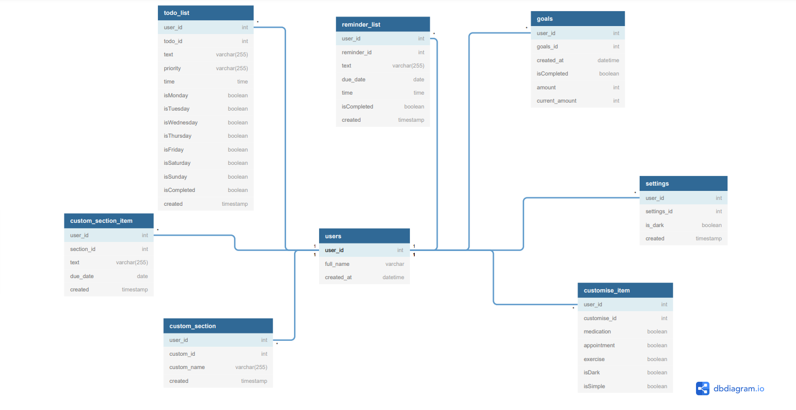

# Simple Database  

This backend create RESTful API architectural style Database HTTP can be handle GET, PUT, POST and DELETE data types  

## DataModel: 
 
  


## Connection:  

Enviromental variable used to connect between backend and Heroku Database.  

So need to create .env file and that file should have DATABASE_URL details without quotation mark and space see below example 
example: .env
DATABASE_URL=CONNECTIONDETAILS  


## Tools:  

  

  
 

  

 

  

  
--

## Scripts  

#### NODEMON -- npm run dev 
#### create table -- npm run db:createusers
#### test scripts 
                - npm run testApp
                - npm run testRoutes
                - npm run testReminders
                - npm run testTodo
                - npm run testSetting
                - npm run testGoals
                - npm run testCustomS
                - npm run testCustomItem
                - npm run testUsers
#### delete individual table
                            - npm run db:droptodo
                            - npm run db:dropgoals
                            - npm run db:dropcustom
                            - npm run db:dropusers
                            - npm run db:dropSettings
                            - npm run db:dropCustomItem
                            - npm run db:dropReminder 
                            - npm run db:dropUsers
## API Reference

### Get all users
```http
  GET /api/users
```

| Parameter | Type     | Description                |
| :-------- | :------- | :------------------------- |
| `api_key` | `string` | **Required**. Your API key |

### Get users

```http
  GET /api/users/${user_id}
```

| Parameter | Type     | Description                       |
| :-------- | :------- | :-------------------------------- |
| `user_id`      | `string` | **Required**. Id of users to fetch |


### Get user todo

```http
  GET /api/users/${user_id}/todo
```

| Parameter | Type     | Description                       |
| :-------- | :------- | :-------------------------------- |
| `user_id`      | `string` | **Required**. Id of users to fetch |

### Get a todo
```http
  GET /api/users/${user_id}/todo/${todo_id}
```

| Parameter | Type     | Description                       |
| :-------- | :------- | :-------------------------------- |
| `user_id and todo_id`      | `string` | **Required**. Id of users and todo  to fetch |

Same operation all other routes only need to change specific table name and table id for the routes.


### example: ```http
  GET /api/users/${user_id}/reminders
```
```http
  GET /api/users/${user_id}/reminders/${reminder_id}
```
### USERS POST/PUT/DELETE

```http
  POST/api/users/
```
```http
  PUT /api/users/${user_id}
```
```http
  DELETE/api/users/${user_id}
```
```http
  DELETE/api/users      ------this will delete all the users-----
```
### POST/PUT/DELETE-- todo, reminders, custom_section, custom_section_item, goals, settings

```http
  POST/api/users/${user_id}/todo or reminders or custom_section or custom_section_item or goals or settings
```
```http
  PUT /api/users/${user_id}/todo/${todo_id} ---same goes all other routes---
```
```http
  DELETE/api/users/${user_id}/todo it will delete all the todo for the user_id
```
```http
  DELETE/api/users/todo/${todo_id} ----this will delete specific todo---
```


